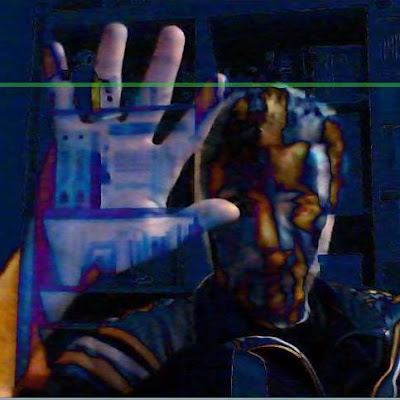

## Hello everyone👋

I’m Max Farnea. I’ve always been passionate about music, computer science, and electronics—and all the ways they intersect and inspire each other.

My work spans electronic music composition, live performance, installations, circuit bending, DIY synth and audio/MIDI circuit building, microcontrollers, creative coding, fractals, video games, and computer graphics.

<!--
**maxfarnea/maxfarnea** is a ✨ _special_ ✨ repository because its `README.md` (this file) appears on your GitHub profile.

Here are some ideas to get you started:

- 🔭 I’m currently working on ...
- 🌱 I’m currently learning ...
- 👯 I’m looking to collaborate on ...
- 🤔 I’m looking for help with ...
- 💬 Ask me about ...
- 📫 How to reach me: ...
- 😄 Pronouns: ...
- ⚡ Fun fact: ...
-->
